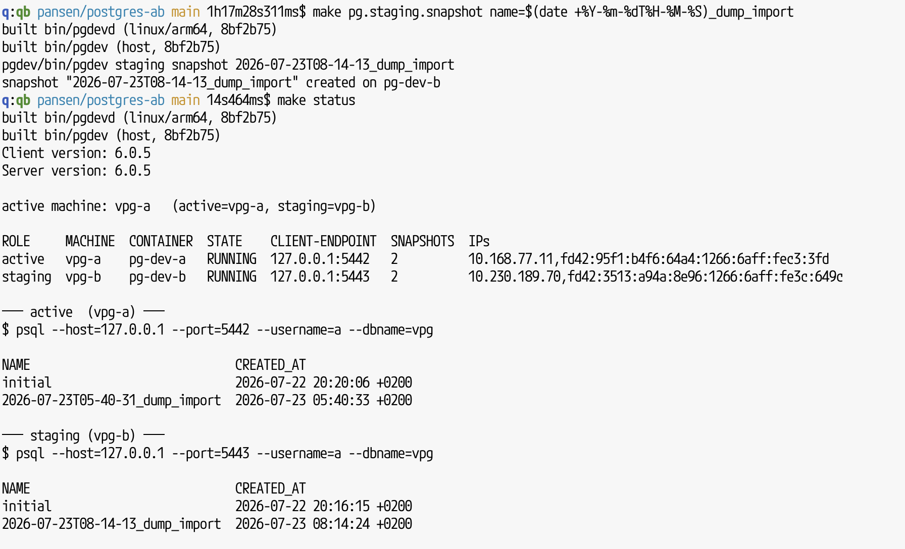

# Snapshottable PostgreSQL on Apple container machine

Fast, snapshottable PostgreSQL for local development on Apple silicon — load a
fresh dump into a spare instance and swap it in without downtime.

`pg_restore` of a large dump can take ~90 minutes, and the dev database is
unreachable the whole time. This repo runs two persistent Apple `container`
machines, **`vpg-a`** and **`vpg-b`**, each hosting one PostgreSQL 17 backend on
its own Incus + copy-on-write XFS snapshot store. One machine is **active**
(serving your app); the other is **staging** (where the next dump loads).
`promote` swaps them.

## Benefits

- **Snapshots in seconds** — XFS reflink (copy-on-write) checkpoints and
  rollbacks, not multi-gigabyte directory copies.
- **Zero-downtime dump loads** — import into staging while active keeps serving,
  then `make pg.promote` swaps roles **without copying data**. Clients use a
  stable endpoint with fixed role ports: `127.0.0.1:5442` (active) / `:5443`
  (staging).
- **On-demand disk reclaim** — `make pg.staging.rebuild` delete+recreates the
  staging machine to free its grown macOS disk, while active keeps serving.
- **Low power at runtime**, thanks to Apple `container`.

### A view



## Requirements

Apple silicon, macOS 26, and Apple's `container` CLI 1.1 or newer — install the
signed package from the
[Apple container releases](https://github.com/apple/container/releases).

## Design

```text
macOS client
    │ 127.0.0.1:5442 (active) / :5443 (staging)   — stable, never changes
    ▼
socat forwarder (host launchd agent)             — re-points on start/promote
    │  maps each role port to whichever machine holds that role
    ├───────────────────────────────┬───────────────────────────────┐
    ▼                               ▼
┌──── vpg-a  <ip>:5432 ────┐   ┌──── vpg-b  <ip>:5432 ────┐
│ Incus host               │   │ Incus host               │
│  pg-dev-a (PostgreSQL 17)│   │  pg-dev-b (PostgreSQL 17)│
│   eth0:5432 ─proxy dev─▶ 127.0.0.1:5432 (in-container) │
│  XFS store + reflink snaps│  │  XFS store + reflink snaps│
└──────────────────────────┘   └──────────────────────────┘
```

Each Apple machine is a persistent outer Linux environment with its own Incus
daemon and one backend, exposed on the machine's `eth0` by a single Incus proxy
device on the backend container (no separate proxy container, no static-IP
pinning). The active/staging role is a **host-side** pointer
(`var/active-machine`), not something a machine knows. The repository stays on
macOS, visible at the same `/Users/...` path through each machine's home mount,
so `.env`, the pointer, and exports live outside the machines.

### Control plane (`pgdev` ↔ `pgdevd`)

A resident daemon, **`pgdevd`**, runs inside **each** machine under systemd and
serves an HTTP/JSON API on that machine's `eth0` (port `5440`, bearer token in
`var/agent-token`). The host CLI, **`pgdev`**, holds one client per machine and
routes by role:

```text
pgdev (macOS) ── HTTP/JSON ──▶ pgdevd (vpg-a | vpg-b) ──▶ Incus socket + XFS store
```

Each daemon serves exactly its one backend (slot-implicit API); active/staging
is decided host-side. So `promote` is purely host: **flip `var/active-machine`,
re-point the forwarder** — no data moves, no daemon call. `up` provisions each
machine's backend from a golden `pg-dev-base` image (PostgreSQL installed once,
then `incus publish`ed) and adds its `eth0` proxy device; `status`/`ip`/
`refresh` fan out over both. Each daemon owns its own single-mutation lock,
write-ahead journal, and crash recovery; machine setup (XFS store + Incus
topology) is `pgdevd bootstrap`, run as its unit's `ExecStartPre`. `make pgdevd`
builds both binaries (one git-stamped version); `pgdev agent deploy` (run by
`make start`, `--machine a|b|both`) delivers the prebuilt daemon and its config
**machine-local** (never read over the home mount at runtime), restarts the
unit, and confirms the `GET /v1/version` handshake. The only remaining
`container exec` passthroughs are the interactive `shell`/`logs` in
`scripts/pg-dev-local` (the host picks the active/staging machine); `psql` is a
plain local `psql` against the `127.0.0.1` endpoint.

### Networking

A backend's nested `incusbr0` address is not routed to macOS. Each backend is
instead exposed on its own machine's `eth0:5432` by a single `bind=host` Incus
proxy device on the backend container, connecting to PostgreSQL on the
container's `127.0.0.1` — so the connect target never drifts and there is no
static-IP pinning. Do not use a backend's 10.x address from macOS.

Each machine's `eth0` IP is an unpinnable `bootpd` DHCP lease that can change
(the whole `/24` too) after a macOS reboot or machine recreation, and the two
leases drift independently. So the client endpoint is decoupled from them: a
per-user `launchd` agent runs `socat` on `127.0.0.1:5442` (active) / `:5443`
(staging) and relays each to whichever machine currently holds that role. The
ports are offset from `5432` so a local PostgreSQL isn't shadowed. Clients always
use **`127.0.0.1:5442`** / **`:5443`** — permanent, identical on every Mac.

Hands-off: **`make start` installs the forwarder and re-points it; `pgdev
promote`/`refresh` re-point it too** (that is what follows a promote to the new
active machine). Needs `socat` (`brew install socat`). `make endpoint.status` /
`endpoint.uninstall` manage it (`PG_ENDPOINT_AUTOINSTALL=0` opts out of
auto-install). `PG_CLIENT_HOST` addresses a machine IP directly instead.

No connection pooler: each port is a per-connection TCP passthrough, so
`CREATE`/`DROP DATABASE`, `LISTEN`/`NOTIFY`, prepared statements, advisory locks
and parallel `pg_restore` behave like direct connections. Promoting re-points
the forwarder, which may drop existing sessions (reconnect); the role ports
don't change.

### Snapshots on Apple's stock kernel

Apple 1.1's recommended container-machine kernel lacks the Btrfs, ZFS, and
DM-thin stack needed by Incus's optimized snapshot backends. Incus therefore
falls back to `dir`, whose snapshots are full directory copies—not practical
for repeated multi-gigabyte PostgreSQL checkpoints.

`pgdevd bootstrap` (each daemon's `ExecStartPre`) instead creates a sparse XFS
loop filesystem (140 GiB by default) inside its machine's root disk, mounts it,
and configures the Incus storage/network/profile. Apple's 1.1 boot examples
show a 512 GiB root device, but that size is not a documented compatibility
guarantee. PostgreSQL data for each slot is mounted from the XFS filesystem,
and snapshot commands use reflink copies. Creating a checkpoint is fast and
consumes additional blocks only as the live dataset and snapshots diverge.

Snapshots cover PostgreSQL data, not the disposable Ubuntu container root, and
are per machine (a hard reset discards that machine's). Every snapshot stops
PostgreSQL cleanly before cloning the data and starts it again
afterward. Restoring an older snapshot retains the original workflow's
timeline semantics: snapshots newer than the target are shown and deleted
after confirmation (interactively you get a [Y/n] prompt, but non-interactively
you must pass `force=1`, e.g. `make pg.restore name=foo force=1`, because stdin
cannot answer prompts through the machine transport).

The XFS size is a logical ceiling; the backing file is sparse. Apple container
CLI 1.1 does not offer a machine disk-size flag. `PG_DATA_DISK_SIZE` is only
used at first creation; to grow it later, raise the value in `.env` and the next
`make start` will expand the sparse XFS store online via `xfs_growfs`. Shrinking
the store is not supported.

### Scope and safety model

This is a local-development tool for one trusted developer and laptop. It is
not replication, automatic failover, a zero-downtime service, or a hardened
multi-user deployment. PostgreSQL durability features such as `fsync` are
deliberately disabled for import speed. Snapshots are checkpoints on the same
physical disk, not backups.

## First setup

```shell
make deps      # also auto-creates .env from .env.example (defaults work; edit if you like)

make start     # first run builds the image and creates both machines (vpg-a, vpg-b)
make pg.up     # provisions each machine's PostgreSQL backend
make pg.status
```

The first `make start` builds an Ubuntu 26.04 machine image (systemd, Incus, jq,
XFS tools) and creates both machines; later starts reuse them. `make pg.up`
installs PostgreSQL 17 in each machine's nested Ubuntu 24.04 container (several
minutes). `make start` also installs and re-points the host forwarder for the
stable `127.0.0.1` endpoint (see [Networking](#networking)).

Status prints endpoints similar to:

```text
active   host=127.0.0.1 port=5442 dbname=<PG_DB>
staging  host=127.0.0.1 port=5443 dbname=<PG_DB>

.pgpass lines:
127.0.0.1:5442:*:<PG_USER>:<PG_PASSWORD>
127.0.0.1:5443:*:<PG_USER>:<PG_PASSWORD>

psql commands:
  active:  psql --host=127.0.0.1 --port=5442 --username=<PG_USER> --dbname=<PG_DB>
  staging: psql --host=127.0.0.1 --port=5443 --username=<PG_USER> --dbname=<PG_DB>
```

Put the printed lines in `~/.pgpass`. The `127.0.0.1` host is permanent — it does
not change across reboots or machine recreation, so saved connection strings keep
working. Set `PG_CLIENT_HOST` to address the machine IP directly instead of the
forwarder.

## Day-to-day workflow

Port 5442 always means the active/current dataset. Port 5443 always means the
opposite staging dataset.

```shell
make start
make pg.status
psql -h 127.0.0.1 -p 5442 -d "$PG_DB"
make pg.logs
```

Load a fresh dump without blocking the active database:

```shell
# 1. Reset staging to a clean start: soft (reflink, instant) or, to also reclaim
#    macOS disk from prior imports, hard (delete+recreate the staging machine).
make pg.staging.reset            # soft
# make pg.staging.rebuild        # hard reset — reclaims disk; active untouched

# 2. Import through the staging port on the stable endpoint.
pg_restore --host=127.0.0.1 --port=5443 --dbname="$PG_DB" \
  --jobs=4 your-dump.pgdump

# 3. Verify and checkpoint staging.
psql -h 127.0.0.1 -p 5443 -d "$PG_DB" -c '\dt'
make pg.staging.snapshot name="$(date +%Y-%m-%dT%H-%M-%S)_dump_import"

# 4. Swap roles. Open connections reconnect; host and ports stay the same.
make pg.promote
```

`make pg.promote` requires **both backends running** (start staging with `make
pg.staging.start` if stopped). If the new data is bad, `make pg.promote` again
immediately points `:5442` back to the previous machine and its untouched data.

## Snapshot and restore commands

Unprefixed commands operate on the active physical slot:

```shell
make pg.snapshot name="$(date +%Y-%m-%dT%H-%M-%S)_before-migration"
make pg.restore name=<snapshot>
make pg.restore-last
make pg.snapshots
```

The staging slot has the parallel command family:

```shell
make pg.staging.snapshot name=<snapshot>
make pg.staging.restore name=<snapshot>
make pg.staging.restore-last
make pg.staging.reset            # soft reset (reflink)
make pg.staging.rebuild          # hard reset: recreate the machine, reclaim disk
make pg.staging.stop
make pg.staging.start
```

`force=1` replaces a same-named snapshot:

```shell
make pg.snapshot name=before-test force=1
```

Snapshot names may contain letters, digits, dots, underscores, and hyphens.

## Inspecting and entering the environments

```shell
make status               # endpoints, roles, states, IPs, timelines
make status/incus         # Incus versions/resources/list
make pg.ip                # both machines' IPs and endpoints
make pg.refresh           # re-discover both machine IPs, re-point the forwarder
make machine.status       # Apple machine JSON (both)
make machine.shell        # shell into the active machine (slot=a|b to pick)
make pg.shell             # shell in the active backend; pg.staging.shell for staging
make pg.logs              # tail active PostgreSQL logs; pg.staging.logs for staging
```

## Deletion and recovery

Snapshots and the XFS data trees disappear with the Apple machine. There is no
built-in full-setup export/import; before a destructive step, dump anything you
need over the client ports with ordinary `pg_dump` (e.g. `pg_dump -h 127.0.0.1
-p 5442 …`) and restore it with `pg_restore` into the staging port afterward.

```shell
make stop          # stop both machines; keep all data
make system.stop   # also stop Apple's container services
make pg.down       # delete each machine's backend container AND its XFS data tree
make delete        # delete BOTH machines and everything inside them
make recreate      # delete both, rebuild, and start fresh
```

`make delete`, `make recreate`, and `make pg.down` are destructive and hit
**both** machines. To reclaim macOS space while staying live, prefer **`make
pg.staging.rebuild`** — it deletes+recreates only the staging machine (freeing
its sparse image) and never touches active. `make recreate` is the full nuke.

## Constraints & gotchas

**Disk space — the sparse-VM-disk trap (important):** the Apple container
machine's root disk (`vdb`) is a **sparse image on macOS that only grows**.
Blocks written inside the guest (the XFS PostgreSQL store, `pg_restore` output,
Incus image layers) are added to the macOS-side image and are **not returned to
macOS when you delete them** — Apple's runtime does not compact the disk on
discard/TRIM, and there is no supported per-machine size cap. So a large restore
can silently ratchet your Mac's free space to zero. When the next guest write
then fails, the loop-backed XFS store shuts down mid-write with an I/O error and
PostgreSQL drops into recovery (you'll see `Input/output error` on data files and
`XFS … Filesystem has been shut down`).

Controls:

- `make disk` — show macOS free space, the Apple container storage footprint,
  the guest root-disk usage, and the `.xfs` store's actual (physical) size.
- `make disk.check` — a fail-fast pre-flight (macOS free space vs
  `DISK_MIN_FREE_GB`, default 40 GiB) that gates `pg.up` and the staging
  restore/reset commands. Set `DISK_MIN_FREE_GB` to **at least the size of the
  dump you're about to restore** (a restore can grow the image by roughly the DB
  size). Note the client-side `pg_restore` itself runs outside make, so this
  guards the step right before it, not the copy.
- **Reclaim** a bloated VM disk by deleting the machine (the only dependable
  shrink — `container system prune` only touches the CLI's image/build cache).
  Everyday: **`make pg.staging.rebuild`** frees the staging machine's image while
  active keeps serving. Full: **`make recreate`** (dump anything you need first).
- **Cap future growth** (strategic): relocate the bulky data onto a dedicated
  APFS volume with a quota (`diskutil apfs addVolume … -quota …`) mounted into
  the machine, so the payload can't consume the whole macOS volume. Not wired up
  here yet — see `issues/`.

**Repository location:** The repository must live under your macOS home directory.
The Apple container machine only mounts `$HOME` (home-mount), and every make
target executes the repo's scripts inside the machine via that mount. A repo
outside `$HOME` fails with a raw missing-directory error.

**systemd status:** `systemctl is-system-running` inside the machine reports
`degraded` permanently. This is expected and harmless—Apple's guest kernel has
no loadable-module support, so `systemd-modules-load` can never succeed.

## Configuration

See `.env.example`. The main settings are:

- `MACHINE_PREFIX` (default `vpg` → `vpg-a`/`vpg-b`), `MACHINE_CPUS`,
  `MACHINE_MEMORY` — per machine (both share the Mac, so memory is per-machine);
- `PG_DATA_DISK_SIZE` — first-creation XFS logical size (per machine);
- `PG_BACKEND_PORT` — port each backend is exposed on (`5432`);
- `PG_CLIENT_ACTIVE_PORT`, `PG_CLIENT_STAGING_PORT` — host loopback ports the
  forwarder listens on (`5442`/`5443`);
- `PG_CLIENT_HOST` — client host printed for connections (default `127.0.0.1`).

## Why a Makefile if there is a script?

The lifecycle logic lives in the Go binaries — `pgdev` on the host, `pgdevd` in
the machine — not in the script. The `make` targets are thin, tab-completable
wrappers that call those binaries and cover the Apple-machine chores around them
(`make start`/`delete`/`disk`). The residual `scripts/pg-dev-local` now holds
only the interactive `shell`/`logs` passthroughs, pending their move to SSH.
